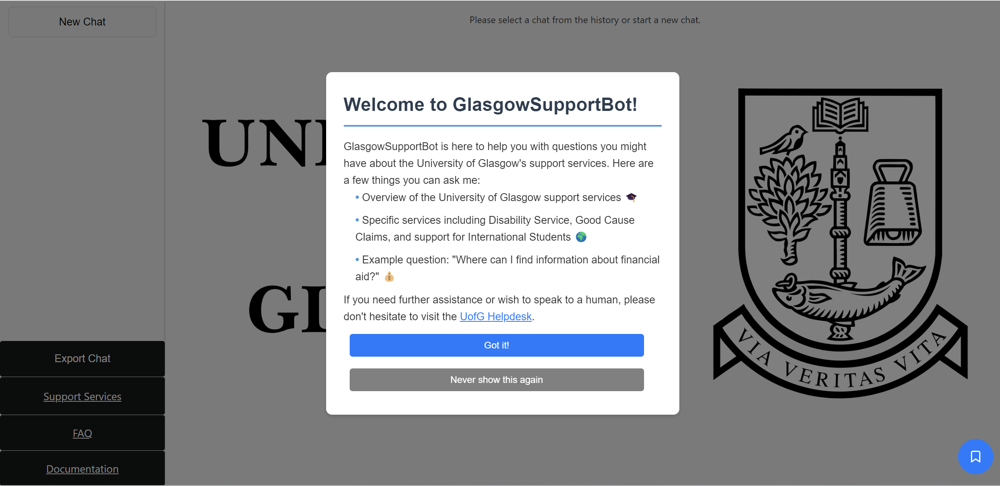
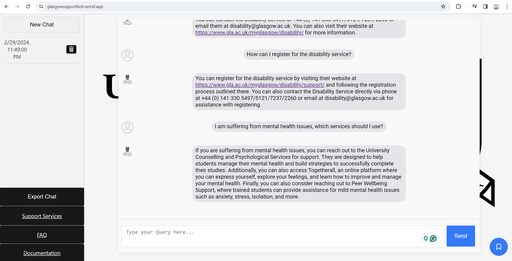
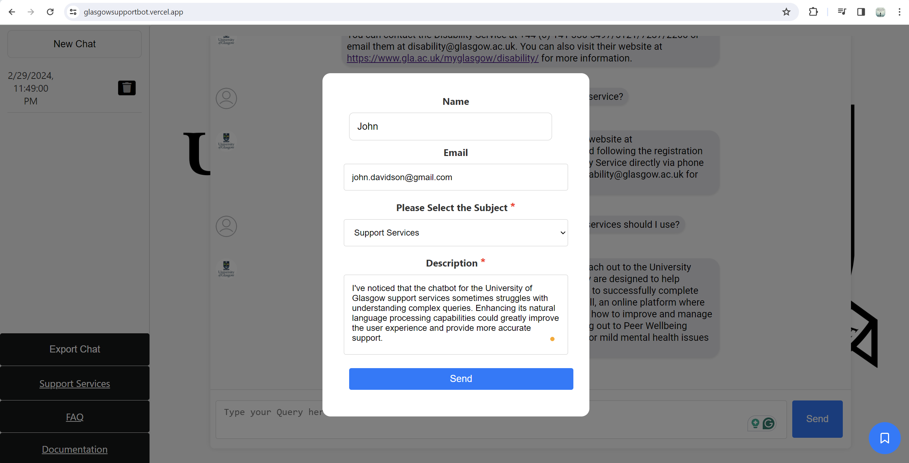
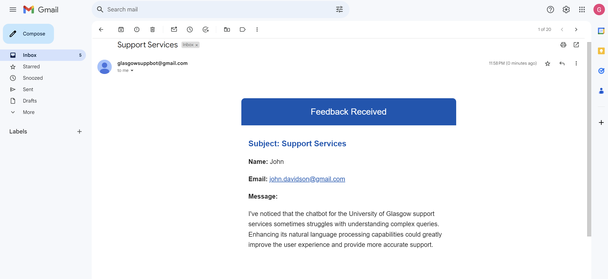

# Glasgow Support Bot

## Introduction

This repository contains the code for the Glasgow Support Bot, a chatbot designed to assist students of the University of Glasgow by providing quick and easy access to information about support services. This tool aims to simplify the process of finding information about various services such as disability support, mental health resources, academic assistance, and more.

### App Interface Overview

Here's a look at the main screen of the app. This view is what users are greeted with upon launching the Glasgow Support Bot.



### Chatting Feature in Action

This screenshot shows the chatting feature, where students can ask questions and receive immediate assistance.



### User Feedback Mechanism

We highly value user feedback as it helps us improve the Glasgow Support Bot. Below is a screenshot illustrating how users can provide feedback about their experience.



### Feedback Submission via Email

After collecting feedback, it's important for us to efficiently process and respond to it. The following screenshot demonstrates the feedback submission process through email.




## Installation and Setup

### Git Installation

Clone this repository using Git:

```bash
git clone https://github.com/Naderalhaffar/GlasgowSupportBot.git
```

### Initial Setup

After cloning the repository, change into the GlasgowSupportBot directory:

```bash
cd GlasgowSupportBot
```

### Create Virtual Environment

**Windows:**

- If you have Anaconda installed:

  ```bash
  conda create --name GlasgowSupportBot
  conda activate GlasgowSupportBot
  ```

- If you don't have Anaconda installed:

  ```bash
  python -m venv GlasgowSupportBot
  GlasgowSupportBot\Scripts\activate
  ```

### Backend Install Dependencies

Navigate to the backend directory:

```bash
cd backend
pip install -r requirements.txt
```

### Install Frontend Dependencies

Before moving to the frontend, make sure you are in the GlasgowSupportBot root directory. Then, activate the virtual environment then navigate to the frontend directory:

```bash
cd frontend
npm install
```

### Launching the App

- In the first terminal (backend), ensure you are in the backend directory then start the backend server:

  ```bash
  python app.py
  ```

- In the second terminal (frontend), ensure you are in the frontend directory then start the frontend:

  ```bash
  npm start
  ```
  ## Testing

This section describes how to run tests for both the backend and frontend components of the Glasgow Support Bot to ensure everything is working correctly.

### Backend Testing with Pytest

To run tests on the backend, you should stay in the `backend` directory. This part of the application comes with a suite of tests to verify the functionality of the support bot's backend services. To execute these tests, use the following command:

```bash
pytest
```

This command will automatically find and run all tests within the backend directory. You should see output indicating the number of tests passed, failed, and possibly skipped. There are 9 tests designed to cover various aspects of the backend functionality.

### Frontend Testing

For testing the frontend, you need to navigate to the specific tests directory inside the frontend part of the application. These tests are designed to ensure that the user interface behaves as expected and interacts correctly with the backend services.

First, ensure you are in the root directory of the Glasgow Support Bot, then move to the frontend tests directory:

```bash
cd frontend/src/Tests
```

Once in the correct directory, you can run the frontend tests using the following command:

```bash
npm test
```

This command will start the test runner in interactive watch mode and execute all `.js` test files located in the Tests directory. It will provide feedback on which tests have passed or failed, allowing you to ensure that the frontend of the Glasgow Support Bot is functioning correctly.

Make sure you have installed all necessary dependencies as described in the installation section before running these tests. This ensures that both the backend and frontend environments are correctly set up for testing.
